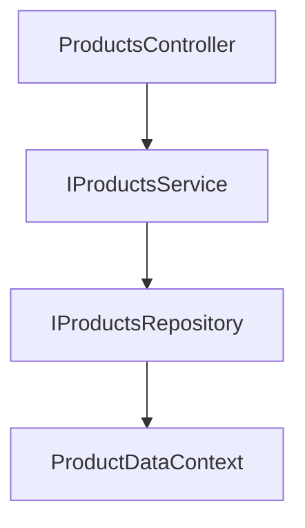

# FruitShelf API 🍏

A lightweight and dockerised .NET 8 Web API demo exposing `products` endpoints with fruit-based sample data.

Portions of this project were assisted or generated using AI tools such as GitHub Copilot or OpenAI ChatGPT, and JetBrains Rider.


---

## 📋 Overview

FruitShelf API is a demo application built with ASP.NET Core 8 and EF Core 8. It manages a simple product catalog of
fruit items, exposing standard CRUD endpoints.

---


## 🚀 Features

- CRUD operations on `Product` resources via RESTful `/api/v1/products`
- Sample domain with 10 fruit-based products (apple, banana, mango, etc.)
- Structured using feature folders for clarity and modularity
- EF Core migrations and PostgreSQL support
- Sample request logging, error-handling and Correlation Id middleware
- Use CancellationTokens to demonstrate conserving resources if a client disconnects.
- Scoped logging 

---

## 🧱 Tech Stack

- **.NET 8** and **ASP.NET Core 8**
- **EF Core 8** with PostgreSQL (via `UseNpgsql`)
- RESTful Controllers
- SeriLog
- Swagger

---

## Endpoints

## ProductsController (`api/products`)

### GET /api/products
- ✅ Returns a list of all products.
- 🔁 Response: `200 OK` + `IEnumerable<ProductDto>`

---

### GET /api/products/{id}
- ✅ Returns a single product by ID.
- 🔁 Response: `200 OK` + `ProductDto`
- 🔁 Error: `404 Not Found` if product does not exist

---

### POST /api/products
- ✅ Creates a new product.
- 🔁 Request: `ProductCreateDto` in body
- 🔁 Response: `201 Created` + `ProductDto`
- 🔁 Error: `400 Bad Request` if validation fails

---

### PUT /api/products/{id}
- ✅ Updates an existing product.
- 🔁 Request: `ProductUpdateDto` in body
- 🔁 Response: `204 No Content` if successful
- 🔁 Error: `404 Not Found` if product does not exist

---

### DELETE /api/products/{id}
- ✅ Deletes a product by ID.
- 🔁 Response: `204 No Content` if deleted
- 🔁 Error: `404 Not Found` if product not found


## Main Class/Interface structure



## 🚧 Getting Started

### Prerequisite

- .NET SDK 8.x
- (Optional) Docker for containerised setup

### Building locally

```bash
git clone git@github.com:nodesandedges/FruitShelf.git
cd FruitShelf
dotnet build
```

### Database seeding
```bash
docker-compose up postgres

dotnet ef database update --project FruitShelf.Data/ --startup-project FruitShelf.API


```

### Building containers & Run with docker compose

```bash
docker-compose build
docker-compose up
```
## License

This project is licensed under the [MIT License](LICENSE).  
You are free to use, modify, and distribute it with minimal restrictions.


